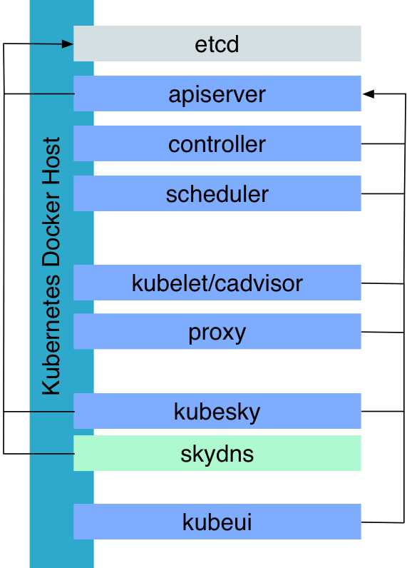

# Kubernetes single node deployment

Idea from https://github.com/vyshane/docker-compose-kubernetes

In the docker-compose.yml file, you see in the commands that it used a single binary hyperkube that allows you to start all the kubernetes components, the API server and the replication controller. One of the components it started is the kubelet which is normally used to monitor containers on one of the host in your cluster and make sure they stay up. Here by passing the `/etc/kubernetes/manifests` it helped us start the other components of kubernetes defined in that manifest.

Note also that the containers where started with a host networking. So these containers have the network stack of the host, you will not see an interface on the docker bridge.

With all those up, grab the kubectl binary, that is your kubernetes client that you will use to interact with the system.



## Create a developer kubernetes machine

```
$ docker-machine create -d virtualbox \
  --virtualbox-memory "3072" \
  --virtualbox-cpu-count "2" kubernetes
$ eval $(docker-machine env kubernetes)
$ export KUBERNETES_MASTER=http://127.0.0.1:8080
$ ./kube-up.sh

```

Quickly there after, you will see a bunch of containers pop-up:

```
$ docker ps --no-trunc --format "{{.Image}} {{.Command}}"
gcr.io/google_containers/pause:0.8.0 "/pause"
gcr.io/google_containers/hyperkube:v1.1.3 "/hyperkube controller-manager --master=127.0.0.1:8080 --v=2"
gcr.io/google_containers/hyperkube:v1.1.3 "/hyperkube scheduler --master=127.0.0.1:8080 --v=2"
gcr.io/google_containers/hyperkube:v1.1.3 "/hyperkube apiserver --service-cluster-ip-range=10.0.0.1/24 --address=127.0.0.1 --etcd-servers=http://127.0.0.1:4001 --cluster-name=kubernetes --v=2"
gcr.io/google_containers/pause:0.8.0 "/pause"
gcr.io/google_containers/etcd:2.0.13 "/usr/local/bin/etcd --addr=127.0.0.1:4001 --bind-addr=0.0.0.0:4001 --data-dir=/var/etcd/data"
gcr.io/google_containers/hyperkube:v1.1.3 "/hyperkube proxy --master=http://127.0.0.1:8080 --v=2"
gcr.io/google_containers/hyperkube:v1.1.3 "/hyperkube kubelet --api_servers=http://127.0.0.1:8080 --v=2 --address=0.0.0.0 --enable_server --hostname_override=127.0.0.1 --config=/etc/kubernetes/manifests"
```


## Install the kubectl at your boot2docker images

```
$ docker-machine ssh kubernetes
$ cd /var/lib/boot2docker
$ sudo /bin/sh
$ cat >bootlocal.sh <<EOF
#!/bin/sh
if [ ! -f "/var/lib/boot2docker/kubectl" ] ; then
  wget https://storage.googleapis.com/kubernetes-release/release/v1.1.3/bin/linux/amd64/kubectl
  chmod +x /var/lib/boot2docker/kubectl
fi
cp /var/lib/boot2docker/kubectl /usr/local/bin
EOF
$ chmod +x bootlocal.sh
$ ./bootlocal.sh
$ exit
```

## Use the kubernetes machine locally

```
$ kubectl get nodes
NAME        LABELS                             STATUS    AGE
127.0.0.1   kubernetes.io/hostname=127.0.0.1   Ready     46s
```

Now start your first container:

```
kubectl run nginx --image=nginx --port=80
```

That's a simple example, where you can actually start a single container. You will want to group your containers that need to be colocated and write a POD description in YAML or json than pass that to kubectl. But it looks like they extended kubectl to take single container start up. That's handy for testing.

Now list your pods:

```
$ kubectl get pods
NAME                   READY     STATUS    RESTARTS   AGE
k8s-master-127.0.0.1   3/3       Running   0          2m
nginx-0ycul            1/1       Running   0          11s
```

You see that there is actually two pods running. The nginx one that you just started and one pod made of three containers. That's the pod that was started by your kubelet to get Kubernetes up. Kubernetes managed by Kubernetes...

It automatically created a replication controller (rc):

```
$ kubectl get rc
CONTROLLER   CONTAINER(S)   IMAGE(S)   SELECTOR    REPLICAS   AGE
nginx        nginx          nginx      run=nginx   1          5m
```
You can have some fun with the scale capability right away and see a new container pop-up.

```
$ kubectl scale --replicas=2 rc/nginx
```

Now that is fine and dandy but there is no port exposed on the host, so you cannot access your application on the outside. That's where you want to define a service. Technically it is used to expose a service to all nodes in a cluster but of course you can bind that service proxy to a publicly routed interface:

```
$ kubectl expose rc nginx --port=80 --external-ip=$(docker-machine ip kubernetes)
```

Now take your browser and open it at `http://$(docker-machine ip kubernetes)` and enjoy a replicated nginx managed by kubernetes deployed in 1 command.

The expose command create a ReplicationController and a Service.
```
$ kubectl describe rc nginx
Name:		nginx
Namespace:	default
Image(s):	nginx
Selector:	run=nginx
Labels:		run=nginx
Replicas:	2 current / 2 desired
Pods Status:	2 Running / 0 Waiting / 0 Succeeded / 0 Failed
No volumes.
Events:
  FirstSeen	LastSeen	Count	From				SubobjectPath	Reason			Message
  ─────────	────────	─────	────				─────────────	──────			───────
  3m		3m		1	{replication-controller }			SuccessfulCreate	Created pod: nginx-zopdj
  3m		3m		1	{replication-controller }			SuccessfulCreate	Created pod: nginx-8818x
$ kubectl describe service nginx
Name:			nginx
Namespace:		default
Labels:			run=nginx
Selector:		run=nginx
Type:			ClusterIP
IP:			172.17.0.130
Port:			<unnamed>	80/TCP
Endpoints:		172.17.0.3:80,172.17.0.4:80
Session Affinity:	None
No events.
```

## Remove old master after reboot

Currently the started master server are not remove if machine has booted.
Every machine restart create new master and pods..

Clean up with following command

```
docker rm $(docker ps -f status=exited -q)
```

## Use your local mac kubectl client

```
$ brew install kubernetes-cli
$ eval $(docker-machine env kubernetes)
$ export KUBERNETES_MASTER=http://127.0.0.1:8080
$ scripts/forward.sh
$ kubectl get nodes
```


## Use kubectl bash completion

```
$ cd /usr/local/etc/bash_completion.d
$ curl -Ls https://raw.githubusercontent.com/kubernetes/kubernetes/master/contrib/completions/bash/kubectl >kubectl
$ chmod +x kubectl
```

## Start the kube-ui

```
$ eval $(docker-machine env kubernetes)
$ export KUBERNETES_MASTER=http://127.0.0.1:8080
$ scripts/kube-ui.sh
$ kubectl --namespace=kube-system get pods
$ kubectl cluster-info
Kubernetes master is running at http://127.0.0.1:8080
KubeUI is running at http://127.0.0.1:8080/api/v1/proxy/namespaces/kube-system/services/kube-ui
```

go to your browser and access the kube-ui with following link

open http://localhost:8080/api/v1/proxy/namespaces/kube-system/services/kube-ui

## Alternate kubernetes visualizer

```
$ git clone https://github.com/saturnism/gcp-live-k8s-visualizer
$ cd gcp-live-k8s-visualizer
$ kubectl proxy --port=8011 --www=%(pwd)
$ open browser http://localhost:8011/static/
$ cd examples
$ kubectl create -f nginx.controller.json
$ kubectl create -f nginx.service.json
```

Add label `visualize=true` to your rc, service and pods descriptions!

## Use DNS

```
$ dig @192.168.99.100 nginx.default.svc.cluster.local

; <<>> DiG 9.8.3-P1 <<>> @192.168.99.100 nginx.default.svc.cluster.local
; (1 server found)
;; global options: +cmd
;; Got answer:
;; ->>HEADER<<- opcode: QUERY, status: NOERROR, id: 62706
;; flags: qr aa rd ra; QUERY: 1, ANSWER: 1, AUTHORITY: 0, ADDITIONAL: 0

;; QUESTION SECTION:
;nginx.default.svc.cluster.local. IN	A

;; ANSWER SECTION:
nginx.default.svc.cluster.local. 30 IN	A	172.17.0.74

;; Query time: 35 msec
;; SERVER: 192.168.99.100#53(192.168.99.100)
;; WHEN: Tue Dec  1 15:48:59 2015
;; MSG SIZE  rcvd: 65
```

other information

```
$ dig +short SRV @192.168.99.100 nginx.default.svc.cluster.local
$ dig +short SRV @$(docker-machine ip kubernetes) nginx.default.svc.cluster.local
$ kubectl describe service nginx
```

## Access other services

```
cd examples
kubectl create -f busybox.yml
kubectl exec -ti busybox /bin/sh
ping nginx
# not working...
```

```
kubectl exec busybox -- nslookup cluster.local
Server:    10.0.0.10
Address 1: 10.0.0.10

Name:      cluster.local
Address 1: 127.0.0.1 localhost
Address 2: 172.17.0.3
Address 3: 172.17.0.2
Address 4: 10.0.0.1
Address 5: 172.17.0.6
Address 6: 10.0.0.10
Address 7: 10.0.0.124
Address 8: 10.0.0.65
Address 9: 172.17.0.4
Address 10: 172.17.0.5 busybox

```

```
kubectl create -f examples/alpine.yml
sleep 2
kubectl exec -ti apline /bin/sh
apk add --update curl
curl nginx.default.svc.cluster.local:9001
...
```

## info from kubectl

```
IP=$(docker-machine ip kubernetes)
curl ${IP}:10255/pods | jq "." | more
curl ${IP}:10255/metrics | more
# can directly use with prometheus monitoring system
curl ${IP}:10255/healtz
```

## cadvisor from Kubectl

open cadvisor with browser `$IP:4194`

## Loadbalancer (ToDo)

Kubernetes

* NodePorts
* Loadbalancer
  * https://github.com/kubernetes/kubernetes/blob/release-1.1/docs/design/horizontal-pod-autoscaler.md

### Ingress

Edge Server

* http://kubernetes.io/v1.1/docs/user-guide/ingress.html
* https://github.com/kubernetes/contrib/tree/master/Ingress/controllers/nginx-alpha
  * Use a simple loadbalancer
  * Add ingress watcher to produce nginx conf
  * Dynamic reflect changed ingress definition

***

Regards

Peter peter.rossbach@bee42.com

## Links

* http://kubernetes.io
* https://github.com/kubernetes/kubernetes/tree/master/cluster/addons/dns
* https://github.com/kubernetes/kubernetes/blob/master/contrib/completions/bash/kubectl
* http://sebgoa.blogspot.de/2015/04/1-command-to-kubernetes-with-docker.html
* https://github.com/vyshane/docker-compose-kubernetes
* https://blog.docker.com/2015/11/deploy-manage-cluster-docker-swarm/
* http://www.dasblinkenlichten.com/installing-cadvisor-and-heapster-on-bare-metal-kubernetes/
* https://github.com/kubernetes-ui/graph
* http://sebgoa.blogspot.de/2015/06/introducing-kmachine-docker-machine.html
